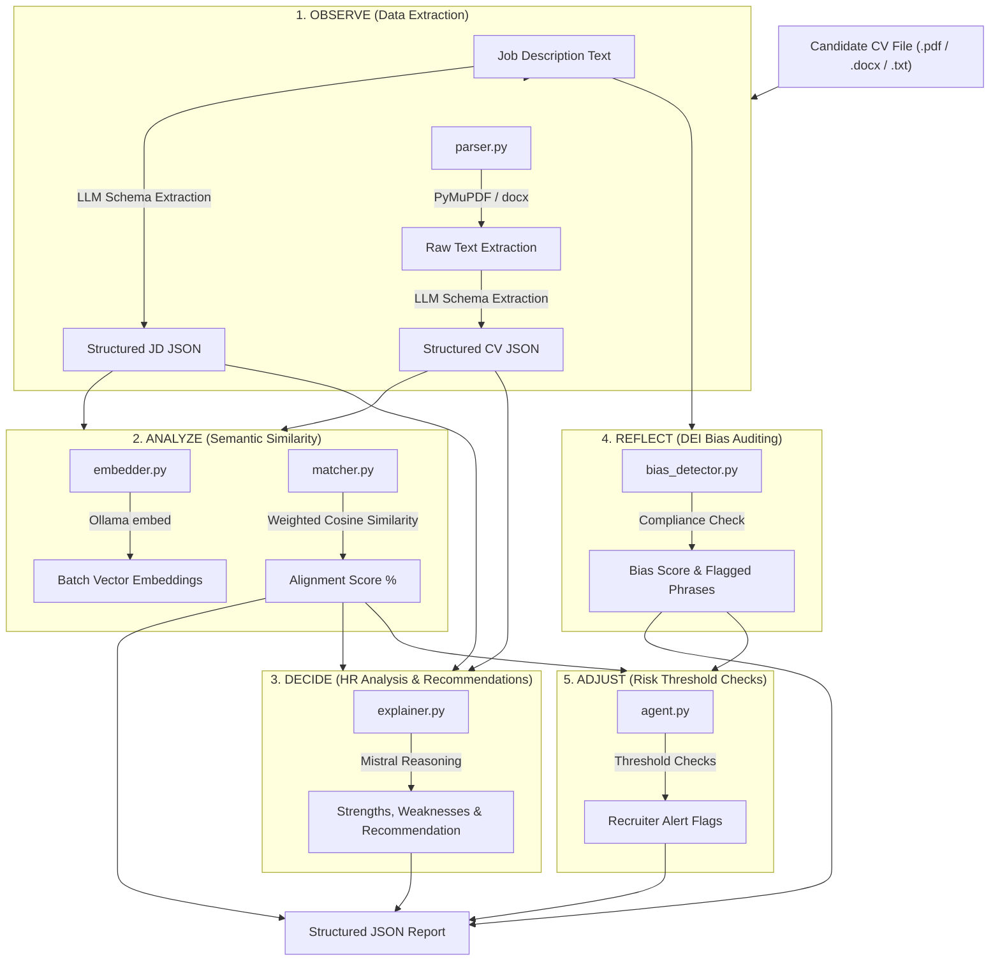

# E.G.O Arbiter: Agent Pipeline Documentation

The core cognitive architecture of the **E.G.O: Arbiter** backend is encapsulated within the pipeline implemented in [agent.py](file:///c:/Users/DELL/OneDrive/Documents/%281%29LCA/LCA-E.G.O-Arbiter/backend/services/agent.py). This pipeline automates the resume evaluation, alignment analysis, reasoning, and DEI bias auditing of candidates against any given job description.

The architecture is structured around an adapted **OODA (Observe, Analyze, Decide, Reflect, Adjust)** cognitive loop.

---

## 🏗️ Architectural Overview

Below is the complete sequence of data flow and service execution across the five cognitive stages:



---

## 🔍 Deep-Dive: The 5 Pipeline Stages

### 1. Observe (Data Extraction)
* **Code Reference:** [parser.py](file:///c:/Users/DELL/OneDrive/Documents/%281%29LCA/LCA-E.G.O-Arbiter/backend/services/parser.py)
* **Goal:** Ingest unstructured inputs (e.g., CV file binary, JD text) and parse them into strictly formatted semantic schemas.
* **Mechanism:**
  * **Text Extraction:** Supports `.pdf` (via PyMuPDF), `.docx`/`.doc` (via python-docx), and raw text decoding.
  * **Structured Mapping:** Submits the extracted raw texts to the local Ollama LLM with specific instruction sets to enforce strict JSON schemas.
* **Data Schemas:**
  ```python
  CV_SCHEMA = {
      "name": "string",
      "summary": "string",
      "skills": ["list of skill strings"],
      "experience": [{"title": "", "company": "", "duration": "", "description": ""}],
      "education": [{"degree": "", "institution": "", "year": ""}],
  }
  
  JD_SCHEMA = {
      "title": "string",
      "summary": "string",
      "required_skills": ["list"],
      "preferred_skills": ["list"],
      "experience_required": "string",
      "education_required": "string",
  }
  ```

---

### 2. Analyze (Semantic Similarity)
* **Code References:** [embedder.py](file:///c:/Users/DELL/OneDrive/Documents/%281%29LCA/LCA-E.G.O-Arbiter/backend/services/embedder.py) | [matcher.py](file:///c:/Users/DELL/OneDrive/Documents/%281%29LCA/LCA-E.G.O-Arbiter/backend/services/matcher.py)
* **Goal:** Generate vector representations of matching segments and calculate alignment mathematically.
* **Mechanism:**
  * **Embedding Creation:** Structured fields are grouped into three key dimensions: **Skills**, **Experience**, and **Education**.
    * *CV Text Consolidated:* `skills` are list items joined; `experience` titles, companies, and durations are joined; `education` elements are combined.
    * *JD Text Consolidated:* `required_skills` and `preferred_skills` are concatenated; `experience_required` and `education_required` are parsed directly.
    * *Batch Embedding Request:* Both structures are passed to the local `bge-m3` embedding model in batch requests.
  * **Cosine Similarity Calculation:**
    For each dimension (Skills, Experience, Education), cosine similarity is calculated between the candidate's vector ($C$) and the job description's vector ($J$):
    $$\text{Similarity}(C, J) = \frac{C \cdot J}{\|C\| \|J\|}$$
  * **Scoring Weights:** A weighted total alignment score is generated. The default weights are loaded from [config.py](file:///c:/Users/DELL/OneDrive/Documents/%281%29LCA/LCA-E.G.O-Arbiter/backend/config.py):
    * **Skills weight:** 50%
    * **Experience weight:** 30%
    * **Education weight:** 20%

---

### 3. Decide (HR Analysis & Recommendations)
* **Code Reference:** [explainer.py](file:///c:/Users/DELL/OneDrive/Documents/%281%29LCA/LCA-E.G.O-Arbiter/backend/services/explainer.py)
* **Goal:** Formulate objective, descriptive human-readable rationales behind the match.
* **Mechanism:**
  * Combines the structured CV, structured JD, and computed similarity scores into a contextual prompt.
  * Requests the LLM (acting as an objective HR analyst) to synthesize fit aspects into a structured decision format.
* **Output Schema:**
  ```json
  {
    "strengths": ["max 3 short bullets"],
    "weaknesses": ["max 3 short bullets"],
    "overall_fit": "one sentence only",
    "recommendation": "Strongly Recommended | Recommended | Consider | Not Recommended"
  }
  ```

---

### 4. Reflect (DEI Bias Auditing)
* **Code Reference:** [bias_detector.py](file:///c:/Users/DELL/OneDrive/Documents/%281%29LCA/LCA-E.G.O-Arbiter/backend/services/bias_detector.py)
* **Goal:** Scan the JD for systemic, demographic, gendered, ageist, cultural, or education-bias phrasing to enforce inclusivity.
* **Mechanism:**
  * The raw Job Description text is audited against inclusive guidelines.
  * The model flags exclusionary terminology, scores the bias level (0-100), and provides alternative phrasing suggestions.
* **Output Schema:**
  ```json
  {
    "bias_score": 0-100,
    "flags": [
      {"phrase": "...", "issue": "...", "suggestion": "..."}
    ],
    "overall_assessment": "string",
    "improved_excerpt": "rewritten version of the most problematic section"
  }
  ```

---

### 5. Adjust (Risk Threshold Checks)
* **Code Reference:** [agent.py:L30-L36](file:///c:/Users/DELL/OneDrive/Documents/%281%29LCA/LCA-E.G.O-Arbiter/backend/services/agent.py#L30-L36)
* **Goal:** Mitigate matching risks and DEI compliance alerts before output presentation.
* **Mechanism:** 
  The pipeline conducts logical checks on the results and appends high-priority `agent_flags` to warn the recruiter:
  * **Low Alignment Flag:** Triggered if computed skill similarity falls below **30%**:
    > "Low skill alignment — consider revising the JD or sourcing differently."
  * **DEI Compliance Flag:** Triggered if the DEI bias score exceeds **60%**:
    > "High bias score detected in JD — review flagged phrases before publishing."

---

## ⚙️ Configuration & Technology Stack

The pipeline runs on a lightweight, local-first stack, ensuring data privacy and fast execution:

* **LLM Engine:** [ollama](file:///c:/Users/DELL/OneDrive/Documents/%281%29LCA/LCA-E.G.O-Arbiter/backend/services/llm_client.py) integration utilizing `mistral` as the reasoning model.
* **Embedding Model:** `nomic-embed-text` running locally via Ollama.
* **Vector Mathematics:** `numpy` for high-performance linear algebra operations in [matcher.py](file:///c:/Users/DELL/OneDrive/Documents/%281%29LCA/LCA-E.G.O-Arbiter/backend/services/matcher.py).
* **API Integration:** Exposed via FastAPI in [routers/evaluate.py](file:///c:/Users/DELL/OneDrive/Documents/%281%29LCA/LCA-E.G.O-Arbiter/backend/routers/evaluate.py).
